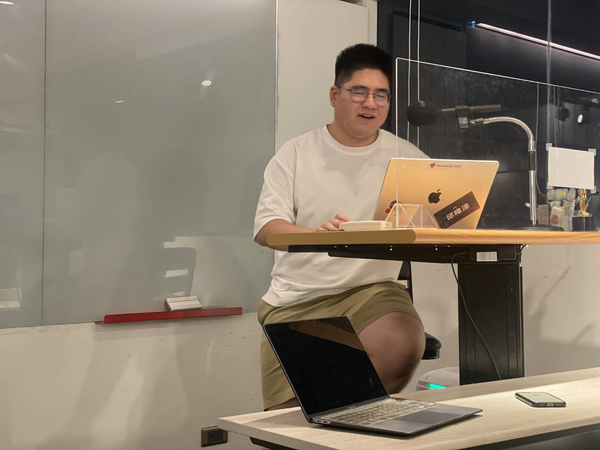
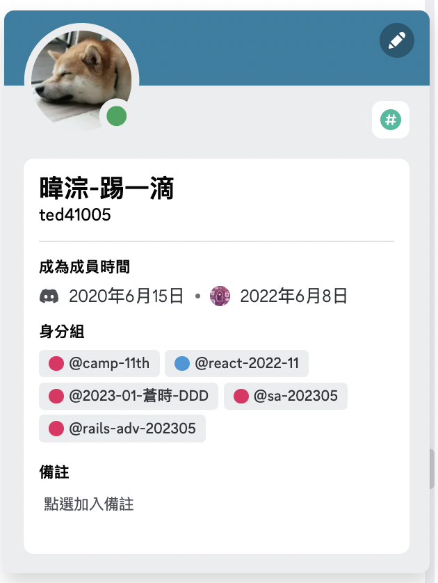

# 繼續學習及前進

第11屆
邱暐淙 TedxTed


<div class="abs-br m-6 flex gap-2">
  <button @click="$slidev.nav.openInEditor()" title="Open in Editor" class="text-xl slidev-icon-btn opacity-50 !border-none !hover:text-white">
    <carbon:edit />
  </button>
  <a href="https://github.com/slidevjs/slidev" target="_blank" alt="GitHub"
    class="text-xl slidev-icon-btn opacity-50 !border-none !hover:text-white">
    <carbon-logo-github />
  </a>
</div>

---
transition: fade-out
layout: two-cols
---
<template v-slot:default>

# 簡單自介

<v-clicks>

## 轉職前經歷 
- 會計系
- 一名爆肝審計查帳員
- 對程式有熱情但沒有架構的學著 / 可以自稱excel界小天才ＸＤ
## 轉職後
- 進入恩沛科技即將任滿一年
- 默默會分享兩次
- 熱衷於參與社群活動

## 然後...
- 依然每天學習著

</v-clicks>

</template>
<template v-slot:right>

  <div class="centered-image-container">
    
  </div>

</template>


---
layout:intro
---

# 經歷了camp你得到了什麼


<v-clicks>

## 回顧這一年，經歷了三個月的camp對我未來有什麼助益

  <ul class="spaced-list">
    <li>來自 “我是上過課，學習過的” 的信心</li>
    <li>我有開發專案的能力，給我時間，sideproject沒問題</li>
    <li>我是五倍出身，龍哥/奶綠...的學生</li>
    <li>學習了 “寫文章” 這件事</li>
  </ul>

## 工作時慶幸自己來自bootcamp
 
  <ul class="spaced-list">
    <li>同學即資源，互相了解這陌生的業界</li>
    <li>我知道要怎麼找答案</li>
    <li>回來問龍哥(超多)，龍哥沒有拒絕過</li>
  </ul>


</v-clicks>

<style>
h2{
  margin-bottom: 5px;
}
.spaced-list {
  margin-top: 1em;
}
.spaced-list li {
  margin-top: 1em;  /* 調整這個值以獲得您希望的間距 */
}
</style>

---
layout: two-cols
---

<template v-slot:default>

# 但你可能還有很多不足

這題`this`你看出來了嗎
```js {all|1|2-8|9-10|all}
var name = '小明';
var obj = {
    x: () => {
        name = '小王';
        console.log(this.name);
    },
    y: '2',
}

obj.x(); 
// 會印出什麼
```

- ruby lamda & proc 有什麼差別
  - 為什麼 model scope 要用 lamda
- 測試怎麼寫

</template>
<template v-slot:right>

# 並且還有好多坑

- js 
  - this
  - react/vue
  - 原型鏈
  - 淺層複製/深層複製
  - IFEE
  - 非同步
- ruby
  - 物件導向
  - 模組/類別/實體
  - self
  - 混入（Mixins）
  - block、Procs和Lambdas

</template>


---
layout: image-right
image: ./public/1018423.jpg
---

# 你該怎麼做

- 找另一個人每天開meet
  - 互相問對方觀念問題
  - 一起做非常小的sideproject
- 一起去咖啡廳或來五倍
  - 但凡事不要有伴才進行
- 務必講出觀念代替心想
- 架自己部落格
  - 寫文章，繼續寫文章

<style>
.footnotes-sep {
  @apply mt-20 opacity-10;
}
.footnotes {
  @apply text-sm opacity-75;
}
.footnote-backref {
  display: none;
}
</style>


---
layout: image
image: /felix-mittermeier-WLGHjbC0Cq4-unsplash.jpg
---
# 該怎麼投履歷

- 🕰️ 準備好了嗎 -> 錯，還沒準備好就必需投
- 🌐 我只投ruby -> 你想得太完美了，所有語言都給我投
- 🚀 我只挑喜歡的 -> 打開履歷,搜尋前端/後端工程師,從第一筆投到最後一筆

## 簡單一句 -> 就是海投

 - 成功不是只靠實力，我想，不要否認運氣佔了很大一部分

 - 如果是這樣，那就不要只等準備好，不要太做自己

---
layout: two-cols-header
---

# 關於明天
::left::
## 你可能必須要知道
- 明天考的是印象分
  - 身體控制好不要亂晃
- 軟性題目是決勝負
  - 團隊困境根本是基本題
  - 個人困境也是
  - 遇到什麼困難然後怎麼應對...
- 明天就是氣場合不合
- 自我介紹超重要
- 故事的邏輯超級重要，講任何故事都必須預先安排順過

::right::
## 關於技術題
- 基本的網站攻擊
- ruby觀念題
- mvc是什麼 -> 老掉牙但就是會考
- 專案用了什麼技術 ，自己又負責什麼
- 你用什麼套件


---
layout: center
---

# 你真的要知道
- 敘述邏輯 -> 任何答案，都必須非常在意前後敘述邏輯
- 任何故事都要與 “所以我熱愛coding” 擦到球
- 練習時只有心裡想是沒用，講給同學聽
- 不要問白癡問題-> ex:你們公司怎麼盈利
- 對廠商都要有基本的認識
- 準備好回問的問題

## 絕對不要說我就是偏向前端，廠商是後端啊大哥

---
layout: image-left
image: /961075.jpg
---
# 歡迎找我
- 技術討論
- or 其他

---
layout: end
---

